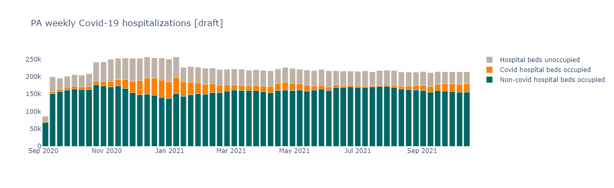
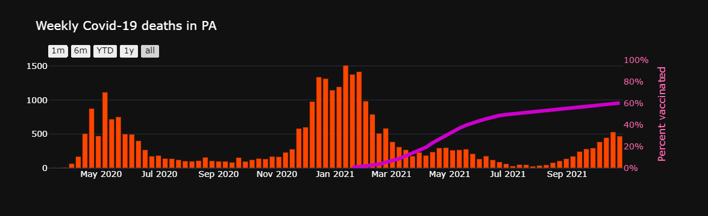
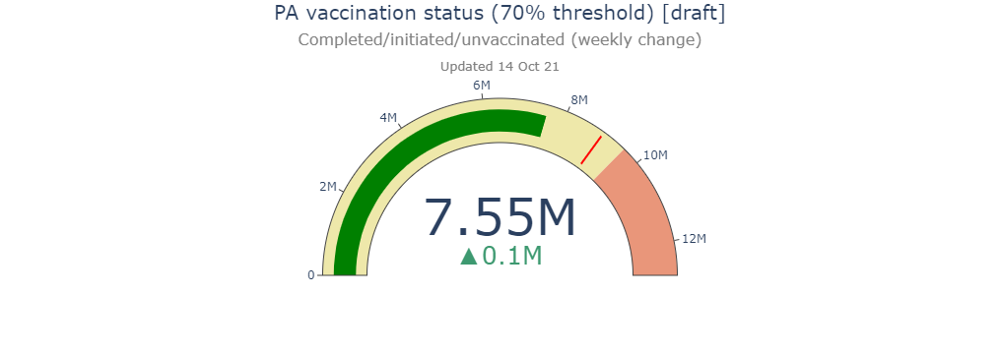
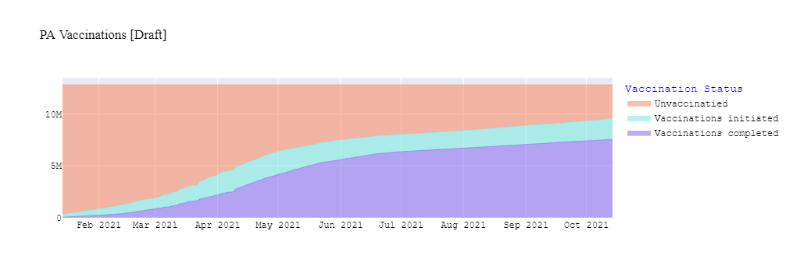
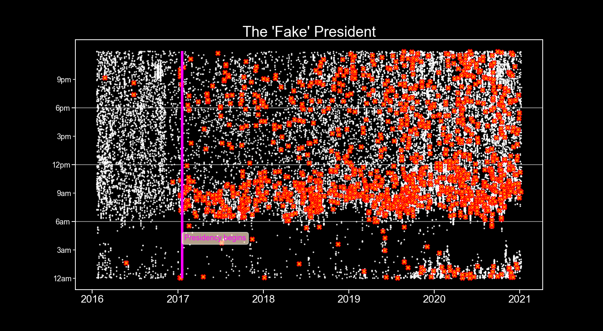
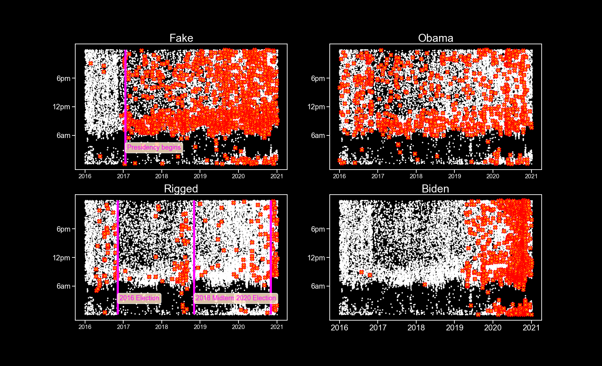
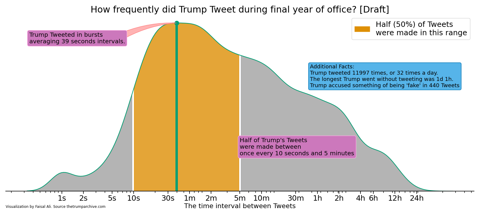

## Hello! Welcome to Faisal Ali's Data Portfolio

I am a data analyst and journalist with a passion for telling stories with numbers, words, graphs and photography. Below are some of my data visualization projects.

### 1. Covid-19 Webscrapers and interactives

The following were all built using the D3 programming library for interactive data visualizations, and pull data off the Covid-19 Act Now API. I'm only uploading still images of my webscrapers for now until I figure out how to connect my local files with my Github repository. Until then, just try to imagine you are clicking those buttons and seeing the data change before your eyes!

I've grouped the daily hospitalization numbers into weekly totals to help smooth out the data and make it easier to read. Daily data can be reported inconsistently which makes viewing weekly trends a better alternative.

Note the actual webscraper is interactive and even lets you filter out the hospitalization types by unselecting them on the legend.

Another chart showing weekly trends, this time for Covid-19 deaths in PA and vaccination rates. I've included a range selector that allows users to filter data for the past month, six months, year-to-date, one year and all.

A vaccination rate counter for the State of Pennsylvania.

A time series of peope getting the vaccine.

### 2. [The Trump Twitter Map](https://github.com/FaisalAli91/Trump_Tweets_proj/blob/main/Trump_tweets_git.ipynb)

FAKE FAKE FAKE! If there is one word that defines the Trump Presidency like no other, it is _FAKE!_

I wanted to visualize how often President Trump Tweeted certain words. As you can see from above, Trump began to accuse things of being FAKE as soon as his term in office began.

Trump's prolific Tweeting provides an insight into the political currents sweeping the nation. Notice the former President begins to flood the zone with _RIGGED!_ accusations before the 2016, 2018 and 2020 elections, and then after the 2020 election when he loses.

You can also observe Trump's attention to his predecessor continues throughout his four years in office, and Biden becomes the focus of his scorn in the lead up to the 2020 Democratic Primaries.

Another way of visualizing the data. I wanted to capture how frequently the President Tweeted during his final year of office. I calculated the time interval between successive Tweets and plotted them on with a kernel density function, which is similar to a histogram for continuous variables.

The visualization shows that Trump Tweeted in 39 second interval bursts, followed by short pauses.

Half of Trump's almost 12,000 Tweets were made between ten seconds to five minutes following the previous Tweet. The longest Trump ever went without Tweeting was 1 day and 1 hour.

The best part of this visualization is there is so much more we can investigate. How often did Trump Tweet on weekends versus weekdays? How often did Trump think/Tweet about Biden or Hilary Clinton or accuse elections of being fake? We could compare Trump's Tweet volume with Obama's – the possibilities are endless! I just need someone to _pay me_ to spend more time on analysis like this!

Source: [The Trump Archive](https://www.thetrumparchive.com/)
