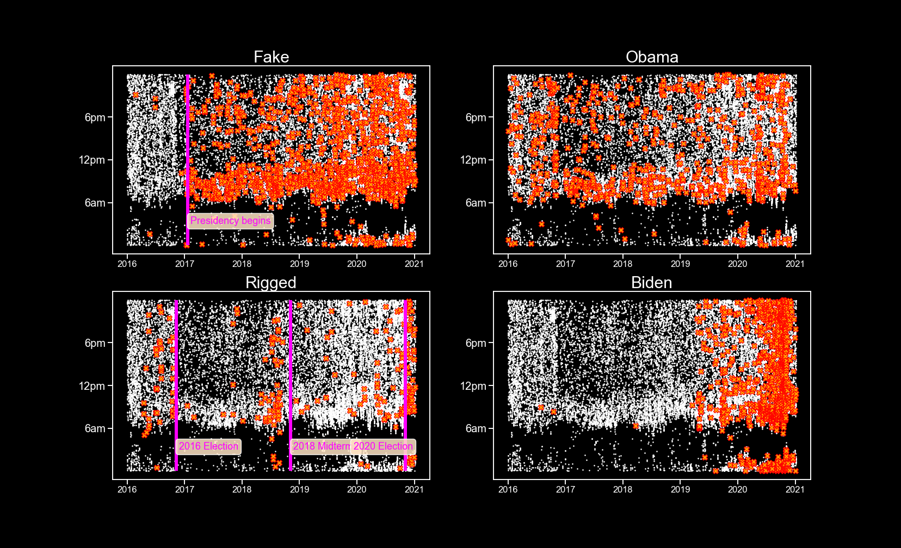

## Hello! Welcome to Faisal Ali's Data Portfolio

I am a data analyst and journalist with a passion for telling stories with numbers, words, graphs and photography. Below are some of my data visualization projects, created in python.

### 1. Calls to the St. Petersburg Police Department in Florida reached their highest levels in 2023 after falling during Covid

Calls to the St. Petersburg Police Department rose sharply in 2023 and reached their highest levels of the past ten years in late Feburary/early March, an analysis of call data from the police department's Computer-Aided Dispatch system shows.

A total of 2.3 million calls were recorded made to the St. Petersburg police department since 2013.

By graphing the total number of calls made each day to the St. Petersburg police departent, and then plotting the two week averages overtop, we can see how calls to the department reach a peak of 743 per day in November, 2019, before dropping substantially in 2020 to a low of 485 calls per day in December, 2020.

However, calls have increased continuously since the beginning of 2021, and spiked significantly in 2023.

Average calls per day for the two week period centered on March 1, 2023 rose to 756 - above the previous pre-pandemic high of 743 in November, 2019.

The data is further broken down by the classification of the call. For instance, we can see calls to the police classfied as traffic incidents and thefts (in a different color scheme):

Traffic incidents rebounded much quicker from the Covid slump, with traffic calls rising above pre-pandemic levels in 2021. Interestingly, there were several days since 2021 with unusually high numbers of calls - 200 to 350 calls, well above the 100 to 150 average. Reported thefts, by contrast, are still below 2020 levels.

We can also slice the data in other ways, for instance visualizing the average number of calls made per hour to the police in 2022.

So on a typical weekday, we see calls to the police kick off at the 6am hour, peak from 8 to 10am with 38 calls an hour, experience a second peak at 2pm, and a final bump at 10pm.

On weekends, the volume of calls follows the same pattern but is typically lower, except after midnight. My guess though is Sunday would have a nighttime profile similar to a weekday, while Friday would also see more activity at night.

While most calls occur during weekdays, noise complaints follow the opposite pattern, reaching the highest levels at night, with two-to-three times the number of calls on weekends versus weekdays:

Using some math and creativity, we can arrange the data and pull out the trends that are of interest to us. For the police department, data on call numbers per hour can be used to schedule police resources over the day. Being able to seperate out individual classifications, such as traffic incidents and noise nuisance, can help organize responses to each effectively.

The trends in calls per day, meanwhile, give us a snapshot of ten years worth of calls in the St. Petersburg community. The most interesting detail to my mind was how calls to the police jumped up sharply in 2023.

Further analysis of that 2023 spike I think would reveal some interesting details, but data alone can't tell us what is happening. For that, we need domain knowledge - interviews with the people of St. Petersburg and police. We would also need to talk with the data administrator to understand how the department's Computer-Aided Dispatch system works, whether it classifies calls correctly, whether calls for the same events are duplicated if there are multiple calls.

As is usually the case with data analysis, the questions lead to yet more questions!

These graphs were created using the Matplotlib and Seaborn data visualization libraries in python and Paint.net for post-processing.

Source: [St. Petersburg Police Department Call Data](https://stat.stpete.org/dataset/Police-Calls/2eks-pg5j)

### 2. Covid-19 Webscrapers and interactives

An analysis of Covid-19 data from the state of Pennsylvania.

The following were created using the D3 programming library for interactive data visualizations, and pull data from the Covid-19 Act Now API. These are still images, but the interactive dashboards can be incorporated into a website or published on Power BI.

I've grouped the daily hospitalization numbers into weekly totals to help smooth out the data and make it easier to read. Daily data can be reported inconsistently which makes viewing weekly trends a better alternative.

Note the actual webscraper is interactive and even lets you filter out the hospitalization types by unselecting them on the legend.

Another chart showing weekly trends, this time for Covid-19 deaths in PA and vaccination rates. I've included a range selector that allows users to filter data for the past month, six months, year-to-date, one year and all.

A vaccination rate counter for the State of Pennsylvania.

A time series of peope getting the vaccine.

### 3. [The Trump Twitter Map](https://github.com/FaisalAli91/Trump_Tweets_proj/blob/main/Trump_tweets_git.ipynb)

FAKE FAKE FAKE! If there is one word that defines the Trump Presidency like no other, it is _FAKE!_

I wanted to visualize how often President Trump Tweeted certain words. As you can see from above, Trump began to accuse things of being FAKE as soon as his term in office began.

Trump's prolific Tweeting provides an insight into the political currents sweeping the nation. Notice the former President begins to flood the zone with _RIGGED!_ accusations before the 2016, 2018 and 2020 elections, and then after the 2020 election when he loses.

You can also observe Trump's attention to his predecessor continues throughout his four years in office, and Biden becomes the focus of his scorn in the lead up to the 2020 Democratic Primaries.

Another way of visualizing the data. I wanted to capture how frequently the President Tweeted during his final year of office. I calculated the time interval between successive Tweets and plotted them on with a kernel density function, which is similar to a histogram for continuous variables.

The visualization shows that Trump Tweeted in 39 second interval bursts, followed by short pauses.

Half of Trump's almost 12,000 Tweets were made between ten seconds to five minutes following the previous Tweet. The longest Trump ever went without Tweeting was 1 day and 1 hour.

The best part of this visualization is there is so much more we can investigate. How often did Trump Tweet on weekends versus weekdays? How often did Trump think/Tweet about Biden or Hilary Clinton or accuse elections of being fake? We could compare Trump's Tweet volume with Obama's – the possibilities are endless! I just need someone to _pay me_ to spend more time on analysis like this!

Source: [The Trump Archive](https://www.thetrumparchive.com/)
